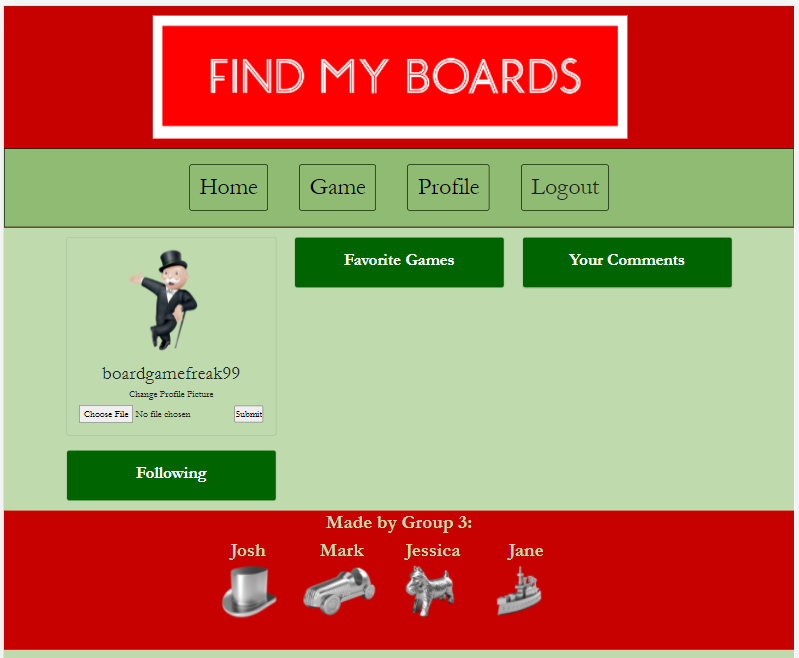

# FindMyBoards

## License

## Table of Contents

1. [Project Description](#project-description)
2. [Installation Instructions](#installation-instructions)
3. [Usage Information](#usage-information)
4. [Contributor Guidelines](#contributor-guidelines)
5. [Testing Instructions](#testing-instructions)
6. [License Info](#license-info)
7. [Questions](#questions)

## Visual Demonstration

[CLICK HERE FOR THE FULL DEMONSTRATION VIDEO!](https:/)

## Project Description

<!-- add project description here -->

## Installation Instructions

<!-- add installation instructions here -->

## Usage Information

<!-- add usage info here -->

## Contributor Guidelines

* [Submit bugs and feature requests](https://github.com/janekv20/FindMyBoards/issues).
* Review [source code changes](https://github.com/janekv20/FindMyBoards/pulls).

## Test Instructions

* None

## License Info

Copyright 2021
The source code for the site is licensed under the MIT license and can be found at the link below:
[License Info Link](https://opensource.org/licenses/MIT)
      

## Questions?

* Find use on Github at:
    * [Jane Vo](https://github.com/janekv20)
    * [Mark Giannelli](https://github.com/mjgiannelli)
    * [Jessica Sheleg](https://github.com/JSheleg)
    * [Joshsands](http://github.com/Joshsands).

* Or e-mail us at:
giannellimj@gmail.com
<!-- add emails here -->
<!-- add emails here -->
josh.sands@mail.com.

## Elevator Pitch

The quarantine enacted by COVID caused us to lose connection with many of our social groups making it difficult to get together and play games.
Many of our friends may have moved or decided to stay in a self quarantine with the pandemic still in full swing. As a result, they find themselves
without anyone to play or discuss one of their favorite hobbies, board games! We created a social platform that will allow this individual to connect
with other board game enthusiasts on games they both enjoy or discover new games together. They will be able to find, follow, and chat with like minded individuals 
in the board game community to create life long connections!